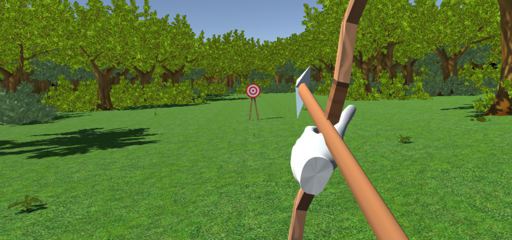

# VRchery

VRchery is a simple virtual reality archery game built in Unity using the Oculus VR stack. It was created as a first VR project / learning demo: you spawn in a medieval-style town with a target ~25m away, and you shoot a limited number of arrows to score points.

Features include a VR UI, bow-and-arrow pullback + release using VR controllers, scoring based on distance from the bullseye, and haptic feedback.

## Project Layout (important)
This repo contains **two separate Unity projects**:

- `VRchery/` — the original project (v1)
- `vrchery 2.0/` — a later (incomplete) iteration (v2)

Open **one folder at a time** in Unity (they each have their own `Assets/`, `Packages/`, and `ProjectSettings/`).

## Technologies Used
* Unity
* Oculus VR

## Requirements
- Windows PC (recommended, given the VR + legacy Unity/Oculus setup)
- Unity Hub
- Unity Editor: **2019.2.17f1** (both `VRchery/` and `vrchery 2.0/` are pinned to this version)
- An Oculus-compatible headset + runtime installed (ex: Oculus app)

## How To Run (Play in Editor)
1. Open Unity Hub.
2. Click **Add** and select **either** `VRchery/` **or** `vrchery 2.0/`.
3. Make sure the project is opened with **Unity 2019.2.17f1**.
4. Let Unity import assets and resolve packages (first open may take a while).
5. Open a game scene:
	 - For `VRchery/`: `Assets/Scenes/Game (updated).unity` (or other scenes in `Assets/Scenes/`)
	 - For `vrchery 2.0/`: `Assets/Scenes/Game Scene.unity` (or other scenes in `Assets/Scenes/`)
6. Ensure your headset is connected and the Oculus runtime is running.
7. Press **Play**.

Note: `ProjectSettings/EditorBuildSettings.asset` currently does not list scenes in the build settings, so you may need to open the scene manually as above.

## How To Build
1. Open the project in Unity.
2. Open the main scene you want to build.
3. Go to **File → Build Settings…**
4. Select the target platform you want (typically **PC, Mac & Linux Standalone → Windows**).
5. Click **Add Open Scenes** (repeat if you have multiple scenes).
6. Click **Build** (or **Build And Run**).

If you run into XR/VR issues, confirm the Oculus runtime is installed and that the project’s XR packages are present under `Packages/manifest.json`.

## Notes
This repository includes third-party assets and Oculus/Unity packages used during development. If you plan to redistribute a build, double-check the licenses for any included assets.
