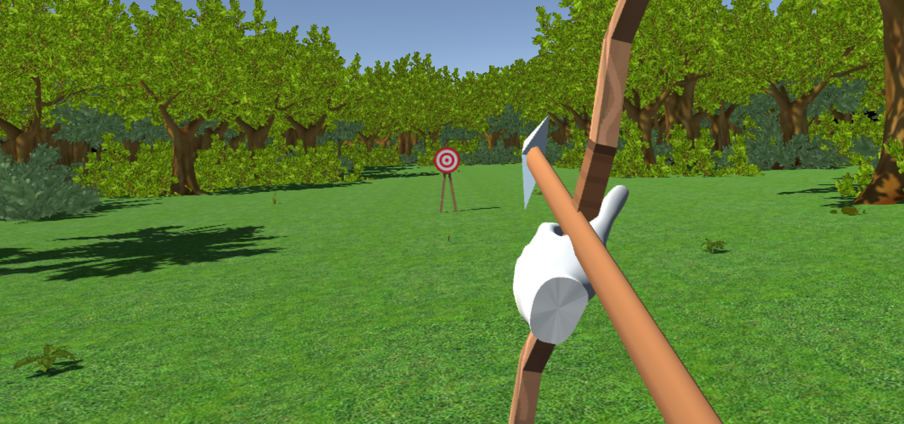

# VRchery

VRchery is a simple virtual reality archery game, developed using OculusVR and Unity. This was my first virtual reality project, and because of this, it's pretty demo-like. The player starts the game in a medieval-esque town, with a target roughly 25 meters away. The player then has 10 arrows, which should be fired at the target in attempt to score as mnay points as possible.

Some features incorporated in this project include a realistic-looking scene, virtual reality UI, realistic bow-and-arrow pullback and firing (using the Oculus controllers), scoring (based on the arrow's distance from the center), heptic feedback, and more.

## Technologies Used
* Unity
* Oculus Rift

## How To Use
Simply load the application in Unity, then build the application or hit "Play".
